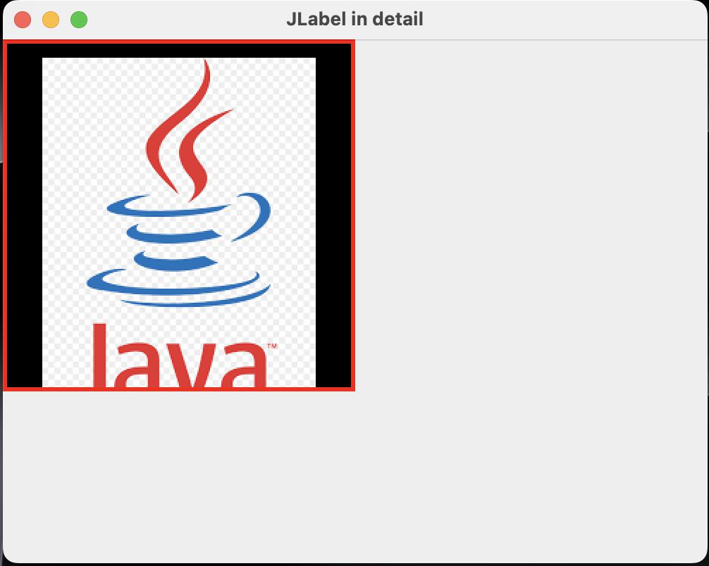

<!-- Improved compatibility of back to top link: See: https://github.com/othneildrew/Best-README-Template/pull/73 -->
<a name="readme-top"></a>
<!--
*** Thanks for checking out the Best-README-Template. If you have a suggestion
*** that would make this better, please fork the repo and create a pull request
*** or simply open an issue with the tag "enhancement".
*** Don't forget to give the project a star!
*** Thanks again! Now go create something AMAZING! :D
-->


<!-- PROJECT LOGO -->
<br />
<div align="center">
    <div style="display:flex; justify-content:center;gap:10px;">
        <h3 align="center">Advance</h3>
        
    </div>
  <p align="center">
    BCA TU 6th semester advance java codes
    <br />
  </p>
</div>

<!-- TABLE OF CONTENTS -->
<details>
  <summary>Table of Contents</summary>
  <ol>
    <li>
      <a href="#about">About</a>
    </li>
    <li>
      <a href="#Topics">Topics</a>
      <ul>
        <li><a href="#GUI-Programming">Unit 1: GUI Programming</a>
        <ol>
            <li><a href="#Introduction-to-Swing">Introduction to Swing</a></li>
            <li><a href="#Creating-a-frame">Creating a Frame</a></li>
            <li><a href="#Positioning-a-frame">Positioning a Frame</a></li>
            <li><a href="#Swing-JLabel">Swing JLabel</a></li>
            <li><a href="#Swing-JPanel">Swing JPanel</a></li>
        </ol>
        </li>
      </ul>
    </li>
  </ol>
</details>

<!-- ABOUT THE PROJECT -->
## About
This repo contains the code written in java. It is focused in Graphical User Interface(GUI) aspect of Java where classes like AWT and Swing are used heavily.

<p align="right">(<a href="#readme-top">back to top</a>)</p>


<!-- GETTING STARTED -->
## Topics

This is the main section of the repo where codes and concepts are arranged in topic wise fashion.

## GUI Programming
The main aim of this chapter is to teach how to use different components of the Java to show visual objects in the UI.

### Introduction to Swing
Swing in Java is a GUI toolkit that provides a set of lightweight, platform-independent components for building graphical user interfaces.<br><br>
To use Swing classes we need to import.<br>
`import javax.swing.*;`

### Creating a frame
To create a frame we need to create a object of the `JFrame` class.
<br>
**Code Example**
```
import javax.swing.JFrame;

JFrame frame = new JFrame(); //creates a frame but doesn't show up
frame.setSize(500, 500); //sets the width and height to 500
frame.setVisible(true); //to make the frame visible

```
### Positioning a frame
We can position a frame to the way we like using `setPosition()` method of `JFrame` class. We need to input the parameter for x-axis and y-axis
<br>
**Code Example**
```
frame.setPosition(200, 300); //draws frame in 200px to x-axis and 300px to y-axis
```
We can also set the location of the frame where it is suitable, it is done by the platform or the OS where it is being drawn. We can use `frame.setLocationByPlatform(true);` method.

### Swing JLabel
JLabel is a component of Swing class which is used to display text or image or both.
We can create object of the JLabel class by importing: `import javax.swing.JLabel`
<br>
JLabel takes likes to take the full area of the JFrame by default.We can use different Layout type to override the default property.

**Example of important methods in JLabel class**
```
//creating a frame
    JFrame frame = new JFrame();
		
		ImageIcon pic = new ImageIcon("happy_emoji.png");
		
		JLabel label = new JLabel();
		label.setText("Hi");
		label.setIcon(pic);
//		label.setVerticalAlignment(JLabel.TOP);
		
		// GUI component which functions as container for holding other components
		JPanel redpanel = new JPanel();
		redpanel.setBounds(0, 0, 250, 250);
		redpanel.setBackground(Color.RED);
		redpanel.setLayout(null); //not using any layout will not show any items even when added 
		redpanel.add(label); //will not appear even after adding because of the null 
		// the position of the label must be specified to make it visible using setBound() method.
		
		JPanel bluepanel = new JPanel();
		bluepanel.setBounds(250, 0, 250, 250);
		bluepanel.setBackground(Color.BLUE);
		
		JPanel greenpanel = new JPanel();
		greenpanel.setBounds(0, 250, 500, 250);
		greenpanel.setBackground(Color.GREEN);
		greenpanel.setLayout(new BorderLayout());
		greenpanel.add(label); // this should be added after the border definition
		
		frame.setTitle("JPanel Example");
		frame.setSize(500, 500);
		frame.setLayout(null); // using the manual layout manager
		frame.setDefaultCloseOperation(JFrame.EXIT_ON_CLOSE);
		
		frame.add(redpanel);
		frame.add(bluepanel);
		frame.add(greenpanel);
		
		frame.setVisible(true);
```
*When we use **BorderLayout()** as the Layout of the panel by default it will set the position of the items to Horizontally LEFT and Vertically CENTER of the Panel.*

**OUTPUT**
<br>


<!-- MARKDOWN LINKS & IMAGES -->
<!-- https://www.markdownguide.org/basic-syntax/#reference-style-links -->
[linkedin-url]: https://www.linkedin.com/in/nitesh-raya-614055249/
[java-logo]: https://upload.wikimedia.org/wikipedia/en/thumb/3/30/Java_programming_language_logo.svg/1200px-Java_programming_language_logo.svg.png

